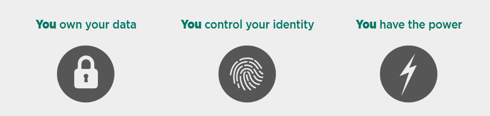

# Decentralized Social Network

### Commits to this repo have been stopped as the project turned out very well. 
### I have made it a private repo on bitbucket. Contact by mail if you are intersted in contributing

## Introduction
Beneath the flashy homepages of your favorite stars lurk Facebook™ and other evil companies out to hoard and sell all your personal data. With the rise of #FakeNews and the high profile political scandals of Facebook, it is time for the next wave of technological advances to come forth.  

What was built to be the ultimate platform for the experience of being social has turned into a money-hungry monster feasting on our privacy and freedom.

## But fear not, for **Decentra** has the answer! And it’s simple:  

An autonomous peer-to-peer network cluster featuring distributed pod networks  
on a private blockchain that ensures user privacy and a whole new level of social

Put even simpler — `it’s a completely free, private and decentralized social experience!`

**Decentra*** is based on three key philosophies:
1. **Decentralization** : Built on a private blockchain
2. **Freedom** : To choose your privacy and how you interact and with whom
3. **Privacy** : You own your data and all the content you produce!  
It is so simple, yet so very beautiful! 

