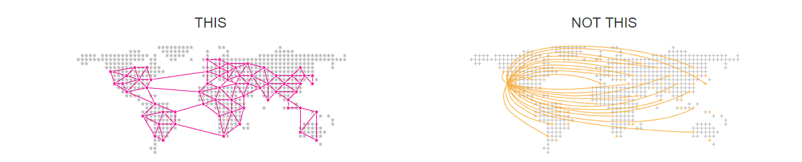

#
## Technical Specifications

#### Hardware required (Server):
- System with atleast Intel core i3 processor or similar, multicore.
- 4GB (Recommended)
- NOT a virtual machine or emulated device.

#### Software required (Server):
- Ubuntu 18.04 with Apache2 server
- Python 3.*
- Google Chrome Browser with Metamask extension
- Ethereum Core
- MongoDB Core / postgreSQL
- Java (JDK8 or above)

#### Hardware required (User):
- Any system with a commonly used OS.
- Atleast Intel core Pentium4 or similar processor or advanced ARM based systems (RPi, most Android devices)
- 1 GB initial free storage
- Internet connection (Minimum speed of 1Mbps)
- 4 GB RAM, 512 MB free.

#### Software required (User):
- Ethereum core
- Ethereum Wallet (Recommended)
- **Decentra** application
- Java (JDK8 or above)

#
## Project Specifications

#### Languages and Frameworks used:
- Python 3.*
- Flask / Django
- React.js
- Node.js
- JSON
- MongoDB / postgreSQL
- Solidity

### Machine Learning Libraries used:
- Numpy
- Matplotlib
- Sklearn
- PyTorch / Tensorflow

#### Inspiration:
- Facebook Scam
- BlockChain Technology

#### References:
- Online course fragments
- Research papers on Consensus Algorithms

#### Future of Decentra:
- Private blockchain, independent of the Ethereum Blockchain.
- Lesser dependencies for the end user - just install the application!
- Few features offered by most social sites today.

#### This is how the decentralized pod network looks v/s the centralized ones!
